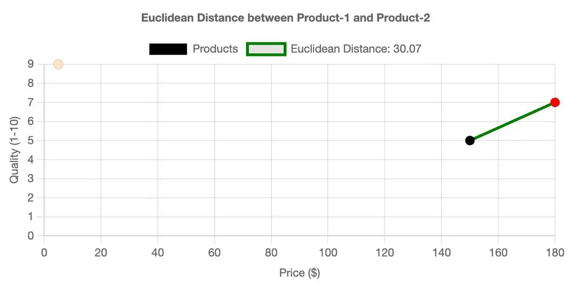
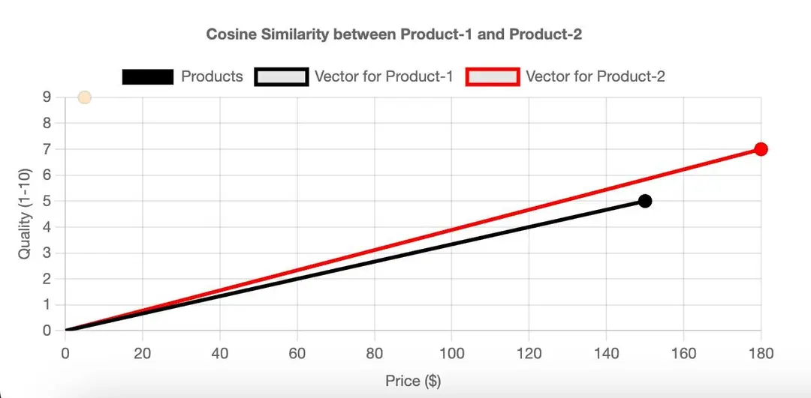
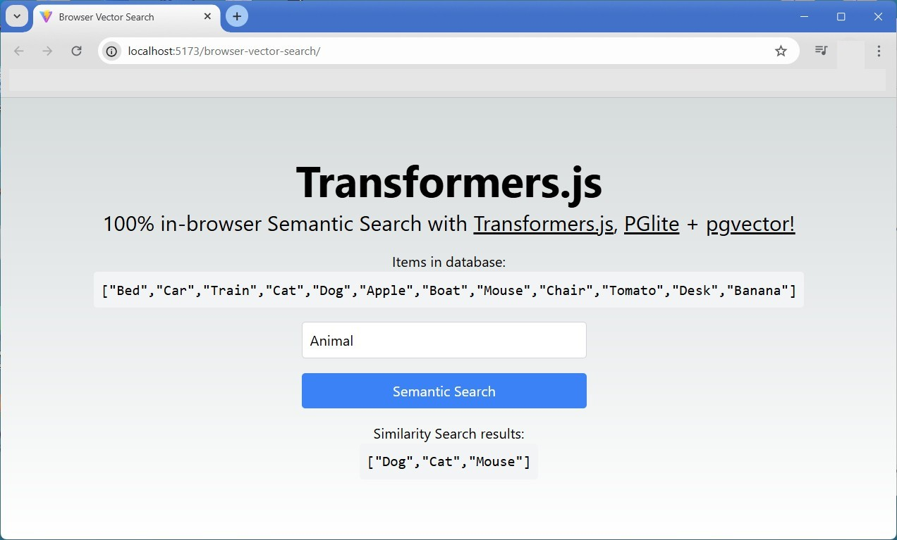

### Redis [Vector Search](https://redis.io/docs/latest/develop/interact/search-and-query/query/vector-search/)


> "So I learned that even after a single day’s experience of the outside world a man could easily live a hundred years in prison. <br />--- The Stranger by Albert Camus" 


#### Prologue

- [Workshop: Searching document data with Redis, JSON, and vector-similarity](https://youtu.be/e4A_k-hFIa4)

- VECTOR - Allows vector queries against the value in this attribute. This requires [query dialect 2](https://redis.io/docs/latest/develop/interact/search-and-query/advanced-concepts/dialects/#dialect-2) or above (introduced in [RediSearch v2.4](https://github.com/RediSearch/RediSearch/releases/tag/v2.4.3)). For more information, see [Vector Fields](https://redis.io/docs/latest/develop/interact/search-and-query/advanced-concepts/vectors/).


#### I. [Vectors](https://redis.io/docs/latest/develop/interact/search-and-query/advanced-concepts/vectors/) Basics (TL;DR)

Redis includes a [high-performance vector database](https://redis.io/blog/benchmarking-results-for-vector-databases/) that lets you perform semantic searches over vector embeddings. You can augment these searches with filtering over text, numerical, geospatial, and tag metadata.

##### **Create a vector index**

```
FT.CREATE <index_name>
  ON <storage_type>
  PREFIX 1 <key_prefix>
  SCHEMA ... <field_name> VECTOR <algorithm> <index_attribute_count> <index_attribute_name> <index_attribute_value>
    [<index_attribute_name> <index_attribute_value> ...]
```

| Parameter | Description |
| ----------- | ----------- |
| index_name | Name of the index. | 
| storage_type | Storage option (HASH or JSON). | 
| prefix (optional) | Key prefix used to select which keys should be indexed. Defaults to all keys if omitted. | 
| field_name | Name of the vector field. | 
| algorithm | Vector index algorithm (FLAT or HNSW). |
| index_attribute_count | Number of vector field attributes. |
| index_attribute_name | Vector field attribute name.. |
| index_attribute_value | Vector field attribute value. |

##### **FLAT INDEX**

> Choose the FLAT index when you have small datasets (< 1M vectors) or when perfect search accuracy is more important than search latency.

| Attribute | Description |
| ----------- | ----------- |
| TYPE | Vector type (BFLOAT16, FLOAT16, FLOAT32, FLOAT64). BFLOAT16 and FLOAT16 require v2.10 or later. |
| DIM | The width, or number of dimensions, of the vector embeddings stored in this field. In other words, the number of floating point elements comprising the vector. DIM must be a positive integer. The vector used to query this field must have the exact dimensions as the field itself. |
| DISTANCE_METRIC | Distance metric (L2, IP, COSINE). |

```
FT.CREATE documents
  ON HASH
  PREFIX 1 docs:
  SCHEMA doc_embedding VECTOR FLAT 6
    TYPE FLOAT32
    DIM 1536
    DISTANCE_METRIC COSINE
```

> In the example above, an index named documents is created over hashes with the key prefix docs: and a FLAT vector field named doc_embedding with three index attributes: TYPE, DIM, and DISTANCE_METRIC.

##### **HNSW index**

> HNSW, or hierarchical navigable small world, is an approximate nearest neighbors algorithm that uses a multi-layered graph to make vector search more scalable.

- The lowest layer contains all data points, and each higher layer contains a subset, forming a hierarchy.

- At runtime, the search traverses the graph on each layer from top to bottom, finding the local minima before dropping to the subsequent layer.

> Choose the HNSW index type when you have larger datasets (> 1M documents) or when search performance and scalability are more important than perfect search accuracy.

| Attribute | Description |
| ----------- | ----------- |
| TYPE | Vector type (BFLOAT16, FLOAT16, FLOAT32, FLOAT64). BFLOAT16 and FLOAT16 require v2.10 or later. |
| DIM | The width, or number of dimensions, of the vector embeddings stored in this field. In other words, the number of floating point elements comprising the vector. DIM must be a positive integer. The vector used to query this field must have the exact dimensions as the field itself. |
| DISTANCE_METRIC	 | Distance metric (L2, IP, COSINE). |

*Optional attributes*

> [HNSW](https://arxiv.org/ftp/arxiv/papers/1603/1603.09320.pdf) supports a number of additional parameters to tune the accuracy of the queries, while trading off performance.

| Attribute | Description |
| ----------- | ----------- |
| M | Max number of outgoing edges (connections) for each node in a graph layer. On layer zero, the max number of connections will be 2 * M. Higher values increase accuracy, but also increase memory usage and index build time. The default is 16. |
| EF_CONSTRUCTION | Max number of connected neighbors to consider during graph building. Higher values increase accuracy, but also increase index build time. The default is 200. |
| EF_RUNTIME | Max top candidates during KNN search. Higher values increase accuracy, but also increase search latency. The default is 10. |
| EPSILON | Relative factor that sets the boundaries in which a range query may search for candidates. That is, vector candidates whose distance from the query vector is radius * (1 + EPSILON) are potentially scanned, allowing more extensive search and more accurate results, at the expense of run time. The default is 0.01. |

```
FT.CREATE documents
  ON HASH
  PREFIX 1 docs:
  SCHEMA doc_embedding VECTOR HNSW 10
    TYPE FLOAT64
    DIM 1536
    DISTANCE_METRIC COSINE
    M 40
    EF_CONSTRUCTION 250
```

> In the example above, an index named documents is created over hashes with the key prefix docs: and an HNSW vector field named doc_embedding with five index attributes: TYPE, DIM, DISTANCE_METRIC, M, and EF_CONSTRUCTION.

##### **Distance metrics**

> Redis supports three popular distance metrics to measure the degree of similarity between two vectors u, v; where n is the length of the vectors:.


> The above metrics calculate distance between two vectors, where the smaller the value is, the closer the two vectors are in the vector space.

- **Euclidean Distance (L2 norm)** calculates the linear distance between two points within a multi-dimensional space. Lower values indicate closer proximity, and hence higher similarity. For illustration purposes, let's assess `product 1 `and `product 2` from the earlier ecommerce dataset and determine the `Euclidean Distance` considering all features. 


- **Inner Product** (dot product) The inner product (or dot product) isn't a distance metric in the traditional sense but can be used to calculate similarity, especially when vectors are normalized (have a magnitude of 1). It's the sum of the products of the corresponding entries of the two sequences of numbers. The inner product can be thought of as a measure of how much two vectors "align" in a given vector space. Higher values indicate higher similarity. However, the raw values can be large for long vectors; hence, normalization is recommended for better interpretation. If the vectors are normalized, their dot product will be 1 if they are identical and 0 if they are orthogonal (uncorrelated).

- **Cosine Similarity** measures the cosine of the angle between two vectors. The cosine similarity value ranges between -1 and 1. A value closer to 1 implies a smaller angle and higher similarity, while a value closer to -1 implies a larger angle and lower similarity. Cosine similarity is particularly popular in NLP when dealing with text vectors. If two vectors are pointing in the same direction, the cosine of the angle between them is 1. If they're orthogonal, the cosine is 0, and if they're pointing in opposite directions, the cosine is -1.


##### **Hash**

> Store or update vectors and any metadata in hashes using the HSET command.

```
HSET docs:01 doc_embedding <vector_bytes> category sports
```

> Hash values are stored as binary-safe strings. The value <vector_bytes> represents the vector's underlying memory buffer.

> The vector blob size must match the dimension and float type of the vector field specified in the index's schema; otherwise, indexing will fail.

##### **JSON**

> To store vectors in Redis as JSON, you store the vector as a JSON array of floats. Note that this differs from vector storage in Redis hashes, which are instead stored as raw bytes.

```
JSON.SET docs:01 $ '{"doc_embedding":[0.34,0.63,-0.54,-0.69,0.98,0.61], "category": "sports"}'
```
> One of the benefits of JSON is schema flexibility. As of v2.6.1, JSON supports multi-value indexing. This allows you to index multiple vectors under the same [JSONPath](https://redis.io/docs/latest/develop/data-types/json/path/).

> You can run vector search queries with the [FT.SEARCH](https://redis.io/docs/latest//commands/ft.search/) or [FT.AGGREGATE](https://redis.io/docs/latest//commands/ft.aggregate/) commands.

> To issue a vector search query with FT.SEARCH, you must set the DIALECT option to >= 2. See the [dialects documentation](https://redis.io/docs/latest/develop/interact/search-and-query/advanced-concepts/dialects/) for more information.

##### **KNN vector search**

> KNN vector search finds the top k nearest neighbors to a query vector. It has the following syntax:
```
FT.SEARCH <index_name>
  <primary_filter_query>=>[KNN <top_k> @<vector_field> $<vector_blob_param> $<vector_query_params> AS <distance_field>]
  PARAMS <query_params_count> [$<vector_blob_param> <vector_blob> <query_param_name> <query_param_value> ...]
  SORTBY <distance_field>
  DIALECT 4
```

| Parameter | Description |
| ----------- | ----------- |
| index_name | Name of the index. |
| primary_filter_query | [Filter](https://redis.io/docs/latest//develop/interact/search-and-query/advanced-concepts/vectors#filters) criteria. Use * when no filters are required. |
| top_k | Number of nearest neighbors to fetch from the index. |
| vector_field | Name of the vector field to search against. |
| vector_blob_param | The query vector, passed in as a blob of raw bytes. The blob's byte size must match the vector field's dimensions and type. |
| vector_query_params (optional) | An optional section for marking one or more vector query parameters passed through the PARAMS section. Valid parameters should be provided as key-value pairs. See which [runtime query params](https://redis.io/docs/latest//develop/interact/search-and-query/advanced-concepts/vectors#runtime-query-params) are supported for each vector index type. |
| distance_field (optional) | The optional distance field name used in the response and/or for sorting. By default, the distance field name is __<vector_field>_score and it can be used for sorting without using AS <distance_field> in the query. |
| vector_query_params_count	 | The number of vector query parameters. |
| vector_query_param_name | The name of the vector query parameter. |
| vector_query_param_value | The value of the vector query parameter. |

```
FT.SEARCH documents "*=>[KNN 10 @doc_embedding $BLOB]" PARAMS 2 BLOB "\x12\xa9\xf5\x6c" DIALECT 4
```

> Alternatively, as of v2.6, <vector_query_params> and <distance_field> name can be specified in runtime [query attributes](https://redis.io/docs/latest/develop/interact/search-and-query/advanced-concepts/query_syntax/#query-attributes) as shown below.
```
[KNN <top_k> @<vector_field> $<vector_blob_param>]=>{$yield_distance_as: <distance_field>}
```

##### **Vector range queries**

> Vector range queries allow you to filter the index using a radius parameter representing the semantic distance between an input query vector and indexed vector fields. This is useful in scenarios when you don't know exactly how many nearest (top_k) neighbors to fetch, but you do know how similar the results should be.

> For example, imagine a fraud or anomaly detection scenario where you aren't sure if there are any matches in the vector index. You can issue a vector range query to quickly check if there are any records of interest in the index within the specified radius.

> Vector range queries operate slightly different than KNN vector queries:

- Vector range queries can appear multiple times in a query as filter criteria.

- Vector range queries can be a part of the <primary_filter_query> in KNN vector search.

```
FT.SEARCH <index_name>
  @<vector_field>:[VECTOR_RANGE (<radius> | $<radius_param>) $<vector_blob_param> $<vector_query_params>]
  PARAMS <vector_query_params_count> [<vector_query_param_name> <vector_query_param_value> ...]
  SORTBY <distance_field>
  DIALECT 4
```

| Parameter | Description |
| ----------- | ----------- |
| index_name | Name of the index. |
| vector_field | Name of the vector field in the index. |
| radius or radius_param | The maximum semantic distance allowed between the query vector and indexed vectors. You can provide the value directly in the query, passed to the PARAMS section, or as a query attribute. |
| vector_blob_param | The query vector, passed in as a blob of raw bytes. The blob's byte size must match the vector field's dimensions and type. |
| vector_query_params (optional) | An optional section for marking one or more vector query parameters passed through the PARAMS section. Valid parameters should be provided as key-value pairs. See which runtime query params are supported for each vector index type. |
| vector_query_params_count | The number of vector query parameters. |
| vector_query_param_name | The name of the vector query parameter. |
| vector_query_param_value | The value of the vector query parameter. |

> A vector range query clause can be followed by a query attributes section as follows:

```
@<vector_field>: [VECTOR_RANGE (<radius> | $<radius_param>) $<vector_blob_param>]=>{$<param>: (<value> |
    $<value_attribute>); ... }
```

> where the relevant parameters in that case are $yield_distance_as and $epsilon. Note that there is no default distance field name in range queries.

##### **Filters**

> Redis supports vector searches that include filters to narrow the search space based on defined criteria. If your index contains searchable fields (for example, TEXT, TAG, NUMERIC, GEO, GEOSHAPE, and VECTOR), you can perform vector searches with filters.

- [Exact match](https://redis.io/docs/develop/interact/search-and-query/query/exact-match/)

- [Numeric range](https://redis.io/docs/develop/interact/search-and-query/query/range/)

- [Full-text](https://redis.io/docs/develop/interact/search-and-query/query/full-text/)

- [Geospatial](https://redis.io/docs/develop/interact/search-and-query/query/geo-spatial/)

> You can also [combine multiple queries](https://redis.io/docs/develop/interact/search-and-query/query/combined/) as a filter.

> Vector search queries with filters follow this basic structure:

```
FT.SEARCH <index_name> <primary_filter_query>=>[...]
```

> where <primary_filter_query> defines document selection and filtering.

```
FT.SEARCH documents "(@title:Sports @year:[2020 2022])=>[KNN 10 @doc_embedding $BLOB]" PARAMS 2 BLOB "\x12\xa9\xf5\x6c" DIALECT 4
```

##### **How filtering works**

> Redis uses internal algorithms to optimize the filtering computation for vector search. The runtime algorithm is determined by heuristics that aim to minimize query latency based on several factors derived from the query and the index.

**Batches mode**

> Batches mode works by paginating through small batches of nearest neighbors from the index:

- A batch of high-scoring documents from the vector index is retrieved. These documents are yielded only if the <primary_filter_query> is satisfied. In other words, the document must contain a similar vector and meet the filter criteria.

- The iterative procedure terminates when <top_k> documents that pass the filter criteria are yielded, or after every vector in the index has been processed.

- The batch size is determined automatically by heuristics based on <top_k> and the ratio between the expected number of documents in the index that pass the <primary_filter_query> and the vector index size.

- The goal is to minimize the total number of batches required to get the <top_k> results while preserving the smallest batch size possible. Note that the batch size may change dynamically in each iteration based on the number of results that pass the filter in previous batches.

**Ad-hoc brute force mode**

- The score of every vector corresponding to a document that passes the filter is computed, and the <top_k> results are selected and returned.

- *This approach is preferable when the number of documents passing the <primary_filter_query> is relatively small*.

- The results of the KNN query will always be accurate in this mode, even if the underlying vector index algorithm is an approximate one.

> The execution mode may switch from batch mode to ad-hoc brute-force mode during the run, based on updated estimations of relevant factors from one batch to another.

##### **Runtime query parameters**

> By default, Redis selects the best filter mode to optimize query execution. You can override the auto-selected policy using these optional parameters:

| Parameter | Description | Options |
| ----------- | ----------- | ----------- |
| HYBRID_POLICY | Specifies the filter mode to use during vector search with filters (hybrid). | BATCHES or ADHOC_BF |
| BATCH_SIZE | A fixed batch size to use in every iteration when the BATCHES policy is auto-selected or requested. | Positive integer. |

> Currently, there are no runtime parameters available for FLAT indexes.

> Optional runtime parameters for HNSW indexes are:

| Parameter | Description | Default Value |
| ----------- | ----------- | ----------- |
| EF_RUNTIME	 | The maximum number of top candidates to hold during the KNN search. Higher values lead to more accurate results at the expense of a longer query runtime. | The value passed during index creation. The default is 10. |
| EPSILON | The relative factor that sets the boundaries for a vector range query. Vector candidates whose distance from the query vector is radius * (1 + EPSILON) are potentially scanned, allowing a more extensive search and more accurate results at the expense of runtime. | The value passed during index creation. The default is 0.01. |

##### **important notes**

1. When performing a KNN vector search, you specify <top_k> nearest neighbors. However, **the default Redis query LIMIT parameter (used for pagination) is 10**. In order to get <top_k> returned results, you must also specify LIMIT 0 <top_k> in your search command. See examples below.

2. **By default, the results are sorted by their document's score**. To sort by vector similarity score, use SORTBY <distance_field>. See examples below.

3. Depending on your chosen distance metric, the calculated distance between vectors in an index have different bounds. For example, **Cosine distance is bounded by 2**, while L2 distance is not bounded. **When performing a vector range query, the best practice is to adjust the <radius> parameter based on your use case** and required recall or precision metrics.

##### **Vector search examples**

> Below are a number of examples to help you get started. For more comprehensive walkthroughs, see the [Redis vector quickstart guide](https://redis.io/docs/latest//develop/get-started/vector-database) and the [Redis AI Resources](https://github.com/redis-developer/redis-ai-resources) Github repo.

**KNN vector search examples**

> Return the 10 nearest neighbor documents for which the doc_embedding vector field is the closest to the query vector represented by the following 4-byte blob:

```
FT.SEARCH documents "*=>[KNN 10 @doc_embedding $BLOB]" PARAMS 2 BLOB "\x12\xa9\xf5\x6c" SORTBY __vector_score DIALECT 4
```

> Return the top 10 nearest neighbors and customize the K and EF_RUNTIME parameters using query parameters. See the "Optional arguments" section in [FT.SEARCH command](https://redis.io/docs/latest//commands/ft.search). Set the EF_RUNTIME value to 150, assuming doc_embedding is an HNSW index:

```
FT.SEARCH documents "*=>[KNN $K @doc_embedding $BLOB EF_RUNTIME $EF]" PARAMS 6 BLOB "\x12\xa9\xf5\x6c" K 10 EF 150 DIALECT 4
```

> Assign a custom name to the distance field (vector_distance) and then sort using that name:

```
FT.SEARCH documents "*=>[KNN 10 @doc_embedding $BLOB AS vector_distance]" PARAMS 2 BLOB "\x12\xa9\xf5\x6c" SORTBY vector_distance DIALECT 4
```

> Use [query attributes](https://redis.io/docs/latest//develop/interact/search-and-query/advanced-concepts/query_syntax#query-attributes) syntax to specify optional parameters and the distance field name:

```
FT.SEARCH documents "*=>[KNN 10 @doc_embedding $BLOB]=>{$EF_RUNTIME: $EF; $YIELD_DISTANCE_AS: vector_distance}" PARAMS 4 EF 150 BLOB "\x12\xa9\xf5\x6c" SORTBY vector_distance DIALECT 4
```

> To explore additional Python vector search examples, review recipes for the [Redis Python](https://github.com/redis-developer/redis-ai-resources/blob/main/python-recipes/vector-search/00_redispy.ipynb) client library and the [Redis Vector Library](https://github.com/redis-developer/redis-ai-resources/blob/main/python-recipes/vector-search/01_redisvl.ipynb).

**Filter examples**

> For these examples, assume you created an index named movies with records of different movies and their metadata.

> Among the movies that have 'Dune' in the title field and year between [2020, 2022], return the top 10 nearest neighbors, sorted by movie_distance:

```
FT.SEARCH movies "(@title:Dune @year:[2020 2022])=>[KNN 10 @movie_embedding $BLOB AS movie_distance]" PARAMS 2 BLOB "\x12\xa9\xf5\x6c" SORTBY movie_distance DIALECT 4
```

> Among the movies that have action as a category tag, but not drama, return the top 10 nearest neighbors, sorted by movie_distance:

```
FT.SEARCH movies "(@category:{action} ~@category:{drama})=>[KNN 10 @doc_embedding $BLOB AS movie_distance]" PARAMS 2 BLOB "\x12\xa9\xf5\x6c" SORTBY movie_distance DIALECT 4
```

> Among the movies that have drama or action as a category tag, return the top 10 nearest neighbors and explicitly set the filter mode (hybrid policy) to "ad-hoc brute force" rather than it being auto-selected:

```
FT.SEARCH movies "(@category:{drama | action})=>[KNN 10 @doc_embedding $BLOB HYBRID_POLICY ADHOC_BF]" PARAMS 2 BLOB "\x12\xa9\xf5\x6c" SORTBY __vec_score DIALECT 4
```

> Among the movies that have action as a category tag, return the top 10 nearest neighbors and explicitly set the filter mode (hybrid policy) to "batches" and batch size 50 using a query parameter:

```
FT.SEARCH movies "(@category:{action})=>[KNN 10 @doc_embedding $BLOB HYBRID_POLICY BATCHES BATCH_SIZE $BATCH_SIZE]" PARAMS 4 BLOB "\x12\xa9\xf5\x6c" BATCH_SIZE 50 DIALECT 4
```

> Run the same query as above and use the query attributes syntax to specify optional parameters:

```
FT.SEARCH movies "(@category:{action})=>[KNN 10 @doc_embedding $BLOB]=>{$HYBRID_POLICY: BATCHES; $BATCH_SIZE: 50}" PARAMS 2 BLOB "\x12\xa9\xf5\x6c" DIALECT 4
```

> To explore additional Python vector search examples, review recipes for the [Redis Python](https://github.com/redis-developer/redis-ai-resources/blob/main/python-recipes/vector-search/00_redispy.ipynb) client library and the [Redis Vector Library](https://github.com/redis-developer/redis-ai-resources/blob/main/python-recipes/vector-search/01_redisvl.ipynb).

**Range query examples**

> For these examples, assume you created an index named products with records of different products and metadata from an ecommerce site.

> Return 100 products for which the distance between the description_vector field and the specified query vector blob is at most 5:

```
FT.SEARCH products "@description_vector:[VECTOR_RANGE 5 $BLOB]" PARAMS 2 BLOB "\x12\xa9\xf5\x6c" LIMIT 0 100 DIALECT 4
```

> Run the same query as above and set the EPSILON parameter to 0.5, assuming description_vector is HNSW index, yield the vector distance between description_vector and the query result in a field named vector_distance, and sort the results by that distance.

```
FT.SEARCH products "@description_vector:[VECTOR_RANGE 5 $BLOB]=>{$EPSILON:0.5; $YIELD_DISTANCE_AS: vector_distance}" PARAMS 2 BLOB "\x12\xa9\xf5\x6c" SORTBY vector_distance LIMIT 0 100 DIALECT 4
```

> Use the vector range query as a filter: return all the documents that contain either 'shirt' in their type tag with their year value in the range [2020, 2022] or a vector stored in description_vector whose distance from the query vector is no more than 0.8, then sort the results by their vector distance, if it is in the range:

```
FT.SEARCH products "(@type:{shirt} @year:[2020 2022]) | @description_vector:[VECTOR_RANGE 0.8 $BLOB]=>{$YIELD_DISTANCE_AS: vector_distance}" PARAMS 2 BLOB "\x12\xa9\xf5\x6c" SORTBY vector_distance DIALECT 4
```

> To explore additional Python vector search examples, review recipes for the [Redis Python](https://github.com/redis-developer/redis-ai-resources/blob/main/python-recipes/vector-search/00_redispy.ipynb) client library and the [Redis Vector Library](https://github.com/redis-developer/redis-ai-resources/blob/main/python-recipes/vector-search/01_redisvl.ipynb).

##### **Next steps**

> Vector embeddings and vector search are not new concepts. Many of the largest companies have used vectors to represent products in ecommerce catalogs or content in advertising pipelines for well over a decade.

> With the emergence of Large Language Models (LLMs) and the proliferation of applications that require advanced information retrieval techniques, Redis is well positioned to serve as your high performance query engine for semantic search and more.

> Here are some additonal resources that apply vector search for different use cases:

- [Retrieval augmented generation from scratch](https://github.com/redis-developer/redis-ai-resources/blob/main/python-recipes/RAG/01_redisvl.ipynb)
- [Semantic caching](https://github.com/redis-developer/redis-ai-resources/blob/main/python-recipes/semantic-cache/semantic_caching_gemini.ipynb)


#### II. Loading the data

Our quote database consists of over two hundreds famous quotes with fhe form of:

```
{
    "author": "Oscar Wilde",
    "quote": "Women are made to be loved, not understood.",
    "source": "Lord Arthur Savile's Crime and Other Stories"
}
```

> To generate sentence embeddings, we'll make use of a Hugging Face model titled [Xenova/all-distilroberta-v1](https://huggingface.co/Xenova/all-distilroberta-v1). It's a compatible version of [sentence-transformers/all-distilroberta-v1](https://huggingface.co/sentence-transformers/all-distilroberta-v1) for transformer.js with ONNX weights.

> Now iterate over the quotes array to store the data as JSON documents in Redis by using the JSON.SET command. 

loadData.js
```
async function main() {
  console.log('number of quotes is', quotes.length)
  process.stdout.write('Loading')
  for (let i = 0; i < quotes.length; i++) { 
    process.stdout.write(".");
    quotes[i].embeddings = await generateSentenceEmbeddings(quotes[i].quote);
    await redisClient.call("JSON.SET", `quote:${i+1}`, "$", JSON.stringify(quotes[i]));
  }
  console.log('Done')
  await disconnect()
}

main()
```


#### III. Creating Vector index 

##### Understand vector databases

> Data is often unstructured, which means that it isn't described by a well-defined schema. Examples of unstructured data include text passages, images, videos, or audio. One approach to storing and searching through unstructured data is to use vector embeddings.

> **What are vectors?** In machine learning and AI, vectors are sequences of numbers that represent data. They are the inputs and outputs of models, encapsulating underlying information in a numerical form. Vectors transform unstructured data, such as text, images, videos, and audio, into a format that machine learning models can process.

- **Why are they important?** Vectors capture complex patterns and semantic meanings inherent in data, making them powerful tools for a variety of applications. They allow machine learning models to understand and manipulate unstructured data more effectively.

- **Enhancing traditional search.** Traditional keyword or lexical search relies on exact matches of words or phrases, which can be limiting. In contrast, vector search, or semantic search, leverages the rich information captured in vector embeddings. By mapping data into a vector space, similar items are positioned near each other based on their meaning. This approach allows for more accurate and meaningful search results, as it considers the context and semantic content of the query rather than just the exact words used.

##### Create an index with a vector field

You must create an index to query document metadata or to perform vector searches. Use the [FT.CREATE](https://redis.io/docs/latest//commands/ft.create) command:

```
FT.CREATE idx:bikes_vss ON JSON
  PREFIX 1 bikes: SCORE 1.0
  SCHEMA
    $.model TEXT WEIGHT 1.0 NOSTEM
    $.brand TEXT WEIGHT 1.0 NOSTEM
    $.price NUMERIC
    $.type TAG SEPARATOR ","
    $.description AS description TEXT WEIGHT 1.0
    $.description_embeddings AS vector VECTOR FLAT 6 TYPE FLOAT32 DIM 768 DISTANCE_METRIC COSINE
```

> Here is a breakdown of the VECTOR field definition:

- $.description_embeddings AS vector: The vector field's JSON path and its field alias vector.

- FLAT: Specifies the indexing method, which is either a flat index or a hierarchical navigable small world graph ([HNSW](https://arxiv.org/ftp/arxiv/papers/1603/1603.09320.pdf)).

- TYPE FLOAT32: Sets the float precision of a vector component, in this case a 32-bit floating point number.

- DIM 768: The length or dimension of the embeddings, determined by the chosen embedding model.

- DISTANCE_METRIC COSINE: The chosen distance function: [cosine distance](https://en.wikipedia.org/wiki/Cosine_similarity).

> You can find further details about all these options in the [vector reference documentation](https://redis.io/docs/latest/develop/interact/search-and-query/advanced-concepts/vectors/).

To create an index for our quotes database: 

```
FT.CREATE idx:quotes ON JSON PREFIX 1 quote:
  SCHEMA
  $.author as author TAG SORTABLE
  $.quote as quote TEXT 
  $.source as source TAG SORTABLE
  $.embeddings as embeddings VECTOR FLAT 6
          TYPE FLOAT32
          DIM 768
          DISTANCE_METRIC COSINE
```

---
For now, let's play with the index just created: 

Example 1: 
```
> FT.SEARCH idx:quotes * LIMIT 0 0
1) "245"
```
This is equivalent to
```
CREATE TABLE quotes (
    id INT UNSIGNED AUTO_INCREMENT PRIMARY KEY,
    author CHAR(100),
    source CHAR(100),
    quote VARCHAR(1000),
    FULLTEXT(quote)
) ENGINE=InnoDB;

INSERT INTO quotes (author, source, quote) VALUES
('Edgar Allan Poe', 'The Works of Edgar Allan Poe', 'All that we see or seem is but a dream within a dream.'),
('Fyodor Dostoevsky', 'Crime and Punishment', 'To go wrong in one’s own way is better than to go right in someone else’s.'),
('Charles Dickens', 'A Tale of Two Cities', 'It was the best of times, it was the worst of times.'),
('Oscar Wilde', 'The Picture of Dorian Gray', 'The only way to get rid of a temptation is to yield to it.');
. . . 

SELECT count(*) FROM quotes
```

Example 2: 
```
> FT.AGGREGATE idx:quotes * GROUPBY 1 @author SORTBY 2 @author ASC
1) "6"
2) 1) "author"
   2) "Agatha Christie"
3) 1) "author"
   2) "Charles Dickens"
4) 1) "author"
   2) "Edgar Allan Poe"
5) 1) "author"
   2) "Fyodor Dostoevsky"
6) 1) "author"
   2) "George Orwell"
7) 1) "author"
   2) "Oscar Wilde"
```
This is equivalent to
```
SELECT DISTINCT author FROM quotes ORDER BY author 
```

Example 3: 
```
> FT.AGGREGATE idx:quotes * GROUPBY 1 @author REDUCE COUNT 0 AS count SORTBY 2 @author ASC 
1) "6"
2) 1) "author"
   2) "Agatha Christie"
   3) "count"
   4) "40"
3) 1) "author"
   2) "Charles Dickens"
   3) "count"
   4) "41"
4) 1) "author"
   2) "Edgar Allan Poe"
   3) "count"
   4) "42"
5) 1) "author"
   2) "Fyodor Dostoevsky"
   3) "count"
   4) "41"
6) 1) "author"
   2) "George Orwell"
   3) "count"
   4) "40"
7) 1) "author"
   2) "Oscar Wilde"
   3) "count"
   4) "41"
```
This is equivalent to
```
SELECT author, count(*) 
FROM quotes 
GROUP BY author
ORDER BY author
```

Example 4:
```
> FT.AGGREGATE idx:quotes * GROUPBY 1 @source REDUCE COUNT 0 AS count SORTBY 2 @count DESC LIMIT 0 99
1) "71"
2) 1) "source"
   2) "Edgar Allan Poe"
   3) "count"
   4) "23"
3) 1) "source"
   2) "Nineteen Eighty-Four"
   3) "count"
   4) "19"
4) 1) "source"
   2) "An Autobiography"
   3) "count"
   4) "17"
5) 1) "source"
   2) "The Brothers Karamazov"
   3) "count"
   4) "14"
6) 1) "source"
   2) "Notes from Underground"
   3) "count"
   4) "10"
7) 1) "source"
   2) "The Picture of Dorian Gray"
   3) "count"
   4) "9"
8) 1) "source"
   2) "Crime and Punishment"
   3) "count"
   4) "9"
9) 1) "source"
   2) "The Soul of Man under Socialism"
   3) "count"
   4) "7"
10) 1) "source"
   2) "Lady Windermere's Fan"
   3) "count"
   4) "7"
11) 1) "source"
   2) "Great Expectations"
   3) "count"
   4) "7"
. . . 
```
This is equivalent to
```
SELECT source, count(*) 
FROM quotes 
GROUP BY source
ORDER BY count(*) DESC
```

Example 5: 
```
> FT.SEARCH idx:quotes "@author:{Charles Dickens} @quote:(dream | love | death)" SUMMARIZE HIGHLIGHT RETURN 2 quote source SORTBY quote ASC LIMIT 0 99
1) "4"
2) "quote:98"
3) 1) "quote"
   2) "<b>loving</b> heart is the truest wisdom... "
   3) "source"
   4) "David Copperfield"
4) "quote:100"
5) 1) "quote"
   2) "do great things. We can only do small things with great <b>love</b>.... "
   3) "source"
   4) "David Copperfield"
6) "quote:109"
7) 1) "quote"
   2) "this: that a thing constructed can only be <b>loved</b> after it is constructed; but a thing created is <b>loved</b> before it exists... "
   3) "source"
   4) "Our Mutual Friend"
8) "quote:113"
9) 1) "quote"
   2) "is a man who would give his life to keep a life you <b>love</b> beside you... "
   3) "source"
   4) "A Tale of Two Cities"
```
This is equivalent to
```
SELECT quote, source 
FROM quotes 
WHERE author = "Charles Dickens" AND 
      MATCH(quote) AGAINST('dream | love | death' IN BOOLEAN MODE)
ORDER BY quote ASC      
LIMIT 0 99
```

*That's fun! Is it not?*
---

> When storing a vector embedding within a JSON document, the embedding is stored as a JSON array. In the example above, the array was shortened considerably for the sake of readability.

> It is vital that you use the same embedding model to embed your queries as you did your documents. Using a different model will result in poor semantic search results or error.

> To utilize a vector query with the [FT.SEARCH](https://redis.io/docs/latest//commands/ft.search/) command, you must specify DIALECT 2 or greater.


#### IV. Searching Through Vectors

> A vector search query on a vector field allows you to find all vectors in a vector space that are close to a given vector. You can query for the k-nearest neighbors or vectors within a given radius.

##### **K-neareast neighbours (KNN)**

> The Redis command [FT.SEARCH](https://redis.io/docs/latest//commands/ft.search) takes the index name, the query string, and additional query parameters as arguments. You need to pass the number of nearest neighbors, the vector field name, and the vector's binary representation in the following way:

```
FT.SEARCH index "(*)=>[KNN num_neighbours @field $vector]" PARAMS 2 vector "binary_data" DIALECT 2
```

> Here is a more detailed explanation of this query:

1. **Pre-filter**: The first expression within the round brackets is a filter. It allows you to decide which vectors should be taken into account before the vector search is performed. The expression (*) means that all vectors are considered.

2. **Next step**: The => arrow indicates that the pre-filtering happens before the vector search.

3. **KNN query**: The expression [KNN num_neighbours @field $vector] is a parameterized query expression. A parameter name is indicated by the $ prefix within the query string.

4. **Vector binary data**: You need to use the PARAMS argument to substitute $vector with the binary representation of the vector. The value 2 indicates that PARAMS is followed by two arguments, the parameter name vector and the parameter value.

5. Dialect: The vector search feature has been available since version two of the query dialect.

> The following example shows you how to query for five quotes based on their quote embeddings, and by using the field embeddings vector. The result is returned in ascending order based on the distance. 

knnQuery.js
```
const queryQuoteEmbeddingsByKNN = async (
      _searchTxt,
      _resultCount,
    ) => {
    console.log(`queryQuotesEmbeddingsByKNN started`);
    let results = {};
    if (_searchTxt) {
      _resultCount = _resultCount ?? 5;
      const searchTxtVectorArr = await generateSentenceEmbeddings(_searchTxt);
      const searchQuery = `(*)=>[KNN ${_resultCount} @embeddings $searchBlob AS score]`;
  
      results = await redisClient.call('FT.SEARCH', 
                                       'idx:quotes', 
                                       searchQuery, 
                                       'RETURN', 4, 'score', 'author', 'quote', 'source', 
                                       'SORTBY', 'score', 
                                       'PARAMS', 2, 'searchBlob', 
                                                    float32Buffer(searchTxtVectorArr), 
                                       'DIALECT', 2);
    } else {
      throw 'Search text cannot be empty';
    }
  
    return results;
  };

async function main() {
  const results = await queryQuoteEmbeddingsByKNN('dream love death')
  console.log(results)
  await disconnect()
}

main()
```


##### **Radius**

> Instead of the number of nearest neighbors, you need to pass the radius along with the index name, the vector field name, and the vector's binary value:

```
FT.SEARCH index "@field:[VECTOR_RANGE radius $vector]" PARAMS 2 vector "binary_data" DIALECT 2
```

> If you want to sort by distance, then you must yield the distance via the range query parameter $YIELD_DISTANCE_AS:

```
FT.SEARCH index "@field:[VECTOR_RANGE radius $vector]=>{$YIELD_DISTANCE_AS: dist_field}" PARAMS 2 vector "binary_data" SORTBY dist_field DIALECT 2
```

> Here is a more detailed explanation of this query:

1. **Range query**: the syntax of a radius query is very similar to the regular range query, except for the keyword VECTOR_RANGE. You can also combine a vector radius query with other queries in the same way as regular range queries. See [combined queries article](https://redis.io/docs/latest/develop/interact/search-and-query/query/combined/) for more details.

2. **Additional step**: the => arrow means that the range query is followed by evaluating additional parameters.

3. **Range query parameters**: parameters such as $YIELD_DISTANCE_AS can be found in the [vectors reference documentation](https://redis.io/docs/latest/develop/interact/search-and-query/advanced-concepts/vectors/).

4. **Vector binary data**: you need to use PARAMS to pass the binary representation of the vector.

5. **Dialect**: vector search has been available since version two of the query dialect.

> The example below shows a radius query that returns the quote and the distance within a radius of 0.5. The result is sorted by the distance.

radiusQuery.js
```
const queryQuoteEmbeddingsByRange = async (
      _searchTxt,
      _radius,
    ) => {
    console.log(`queryQuotesEmbeddingsByRange started`);
    let results = {};
    if (_searchTxt) {
      _radius = _radius ?? 1.5;
      const searchTxtVectorArr = await generateSentenceEmbeddings(_searchTxt);      
      const searchQuery = `@embeddings:[VECTOR_RANGE ${_radius} $searchBlob]=>{$YIELD_DISTANCE_AS: vector_dist}`;      
      results = await redisClient.call('FT.SEARCH', 
                                       'idx:quotes', 
                                       searchQuery, 
                                       'PARAMS', 2, 'searchBlob', 
                                                    float32Buffer(searchTxtVectorArr), 
                                       'SORTBY', 'vector_dist', 'ASC', 
                                       'RETURN', 4, 'vector_dist', 'author', 'quote', 'source', 
                                       'DIALECT', 2);
    } else {
      throw 'Search text cannot be empty';
    }
  
    return results;
  };

async function main() {
  const results = await queryQuoteEmbeddingsByRange('dream love death')
  console.log(results)
  await disconnect()
}

main()
```


> By default, [FT.SEARCH](https://redis.io/docs/latest//commands/ft.search/) returns only the first ten results. The [range query article](https://redis.io/docs/latest/develop/interact/search-and-query/query/range/) explains to you how to scroll through the result set.


#### V. Summary 

> Transformers.js is designed to be functionally equivalent to Hugging Face's [transformers](https://github.com/huggingface/transformers) python library, meaning you can run the same pretrained models using a very similar API. 

[In-Browser Semantic Search with Transformers.js and PGlite + pgvector](https://github.com/huggingface/transformers.js-examples/tree/main/pglite-semantic-search)



- [Introduction to semantic search](./SemanticSearch.md)
- [Introduction to vector search](./VectorSearch.md)
- [Redis as a vector database](./Vector-Database.md)
- [Vector and working with client libraries](./Working-with-node-redis.md)
- [Vector advanced topics](./Vector-advanced-topics.md)
- [Redis for AI final exam](./Exam-Redis-for-AI-exam.pdf)


#### VI. Bibliography
1. [Redis as a Vector Database Explained](https://youtu.be/xhLXZ0Hqudk)
2. [Redis as a vector database](https://university.redis.io/course/7e2qbbeg963twz)
3. [Introduction to vector search](https://university.redis.io/course/yz1lretjfpdlew)
4. [Introduction to semantic search](https://university.redis.io/course/9xcwbkijvf4a4k)
5. [How to Perform Vector Similarity Search Using Redis in NodeJS](https://redis.io/learn/howtos/solutions/vector/getting-started-vector)
6. [Redis as a vector database quick start guide](https://redis.io/docs/latest/develop/get-started/vector-database/)
7. [Query data](https://redis.io/docs/latest/develop/interact/search-and-query/query/)
8. [ioredis](https://github.com/redis/ioredis?tab=readme-ov-file)
9. [Transformers.js](https://github.com/huggingface/transformers.js?tab=readme-ov-file#readme)
10. [pgvector](https://github.com/pgvector/pgvector)
11. [Vector Similarity Search: From Basics to Production](https://mlops.community/vector-similarity-search-from-basics-to-production/)
12. [The Stranger by Albert Camus](https://www.macobo.com/essays/epdf/CAMUS,%20Albert%20-%20The%20Stranger.pdf)


#### Epilogue 

```
{
    "author": "George Orwell",
    "quote": "War is peace. Freedom is slavery. Ignorance is strength.",
    "source": "Nineteen Eighty-Four"
}
```


### EOF (2025/02/18)