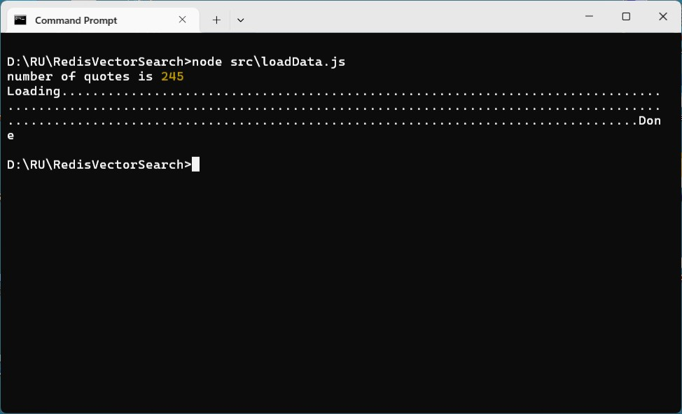

### Redis [Vector Search](https://redis.io/docs/latest/develop/interact/search-and-query/query/vector-search/)


#### Prologue

[Workshop: Searching document data with Redis, JSON, and vector-similarity](https://youtu.be/e4A_k-hFIa4)

Simon Prickett & Brian Sam-Bodden

01:13:26 Introducing Vector Similarity Search
01:20:03 What are Vectors?
01:23:57 Vector Embeddings
01:28:09 Vector Databases
01:29:18 Redis as a Vector Database
01:32:04 Vector Similarity Demo with Python
01:55:59 Semantic Queries
01:57:21 Visualizing Embeddings and Constructing Queries
02:03:51 Hybrid Queries
02:05:56 Range Queries
02:08:23 Running Queries and Visualizing Results
02:10:12 Vector Similarity Recap

[transformers.js-examples]{https://github.com/huggingface/transformers.js-examples}
[In-Browser Semantic Search with Transformers.js and PGlite + pgvector](https://github.com/huggingface/transformers.js-examples/tree/main/pglite-semantic-search)

plagiarize

#### I. [Vectors](https://redis.io/docs/latest/develop/interact/search-and-query/advanced-concepts/vectors/) Basics

> VECTOR - Allows vector queries against the value in this attribute. This requires [query dialect 2](https://redis.io/docs/latest/develop/interact/search-and-query/advanced-concepts/dialects/#dialect-2) or above (introduced in [RediSearch v2.4](https://github.com/RediSearch/RediSearch/releases/tag/v2.4.3)). For more information, see [Vector Fields](https://redis.io/docs/latest/develop/interact/search-and-query/advanced-concepts/vectors/).

```
FT.CREATE <index_name>
  ON <storage_type>
  PREFIX 1 <key_prefix>
  SCHEMA ... <field_name> VECTOR <algorithm> <index_attribute_count> <index_attribute_name> <index_attribute_value>
    [<index_attribute_name> <index_attribute_value> ...]
```

| Parameter | Description |
| ----------- | ----------- |
| index_name | Name of the index. | 
| storage_type | Storage option (HASH or JSON). | 
| prefix (optional) | Key prefix used to select which keys should be indexed. Defaults to all keys if omitted. | 
| field_name | Name of the vector field. | 
| algorithm | Vector index algorithm (FLAT or HNSW). |
| index_attribute_count | Number of vector field attributes. |
| index_attribute_name | Vector field attribute name.. |
| index_attribute_value | Vector field attribute value. |

**FLAT INDEX**

> Choose the FLAT index when you have small datasets (< 1M vectors) or when perfect search accuracy is more important than search latency.

| Attribute | Description |
| ----------- | ----------- |
| TYPE | Vector type (BFLOAT16, FLOAT16, FLOAT32, FLOAT64). BFLOAT16 and FLOAT16 require v2.10 or later. |
| DIM | The width, or number of dimensions, of the vector embeddings stored in this field. In other words, the number of floating point elements comprising the vector. DIM must be a positive integer. The vector used to query this field must have the exact dimensions as the field itself. |
| DISTANCE_METRIC | Distance metric (L2, IP, COSINE). |

```
FT.CREATE documents
  ON HASH
  PREFIX 1 docs:
  SCHEMA doc_embedding VECTOR FLAT 6
    TYPE FLOAT32
    DIM 1536
    DISTANCE_METRIC COSINE
```

> In the example above, an index named documents is created over hashes with the key prefix docs: and a FLAT vector field named doc_embedding with three index attributes: TYPE, DIM, and DISTANCE_METRIC.

**Distance metrics**

> Redis supports three popular distance metrics to measure the degree of similarity between two vectors.


- Euclidean distance is a measure of the straight-line distance between two points in Euclidean space. In two-dimensional space, this is the familiar distance we think of in geometry.
- The inner product, also known as the dot product, is a fundamental operation in linear algebra and vector calculus. It is a way to multiply two vectors to produce a scalar (a single number).
- Cosine distance is a measure of the angle between two non-zero vectors in a multi-dimensional space. It is derived from the cosine similarity, which measures the cosine of the angle between two vectors. While cosine similarity ranges from -1 to 1, cosine distance is a measure that ranges from 0 to 1 and represents the angular distance between the vectors.

> The above metrics calculate distance between two vectors, where the smaller the value is, the closer the two vectors are in the vector space.

**JSON**

> To store vectors in Redis as JSON, you store the vector as a JSON array of floats. Note that this differs from vector storage in Redis hashes, which are instead stored as raw bytes.

```
JSON.SET docs:01 $ '{"doc_embedding":[0.34,0.63,-0.54,-0.69,0.98,0.61], "category": "sports"}'
```
> One of the benefits of JSON is schema flexibility. As of v2.6.1, JSON supports multi-value indexing. This allows you to index multiple vectors under the same [JSONPath](https://redis.io/docs/latest/develop/data-types/json/path/).

> You can run vector search queries with the [FT.SEARCH](https://redis.io/docs/latest//commands/ft.search/) or [FT.AGGREGATE](https://redis.io/docs/latest//commands/ft.aggregate/) commands.

> To issue a vector search query with FT.SEARCH, you must set the DIALECT option to >= 2. See the [dialects documentation](https://redis.io/docs/latest/develop/interact/search-and-query/advanced-concepts/dialects/) for more information.

**KNN vector search**

> KNN vector search finds the top k nearest neighbors to a query vector. It has the following syntax:
```
FT.SEARCH <index_name>
  <primary_filter_query>=>[KNN <top_k> @<vector_field> $<vector_blob_param> $<vector_query_params> AS <distance_field>]
  PARAMS <query_params_count> [$<vector_blob_param> <vector_blob> <query_param_name> <query_param_value> ...]
  SORTBY <distance_field>
  DIALECT 4
```

| Parameter | Description |
| ----------- | ----------- |
| index_name | Name of the index. |
| primary_filter_query | [Filter](https://redis.io/docs/latest//develop/interact/search-and-query/advanced-concepts/vectors#filters) criteria. Use * when no filters are required. |
| top_k | Number of nearest neighbors to fetch from the index. |
| vector_field | Name of the vector field to search against. |
| vector_blob_param | The query vector, passed in as a blob of raw bytes. The blob's byte size must match the vector field's dimensions and type. |
| vector_query_params (optional) | An optional section for marking one or more vector query parameters passed through the PARAMS section. Valid parameters should be provided as key-value pairs. See which [runtime query params](https://redis.io/docs/latest//develop/interact/search-and-query/advanced-concepts/vectors#runtime-query-params) are supported for each vector index type. |
| distance_field (optional) | The optional distance field name used in the response and/or for sorting. By default, the distance field name is __<vector_field>_score and it can be used for sorting without using AS <distance_field> in the query. |
| vector_query_params_count	 | The number of vector query parameters. |
| vector_query_param_name | The name of the vector query parameter. |
| vector_query_param_value | The value of the vector query parameter. |

```
FT.SEARCH documents "*=>[KNN 10 @doc_embedding $BLOB]" PARAMS 2 BLOB "\x12\xa9\xf5\x6c" DIALECT 4
```

> Alternatively, as of v2.6, <vector_query_params> and <distance_field> name can be specified in runtime [query attributes](https://redis.io/docs/latest/develop/interact/search-and-query/advanced-concepts/query_syntax/#query-attributes) as shown below.
```
[KNN <top_k> @<vector_field> $<vector_blob_param>]=>{$yield_distance_as: <distance_field>}
```
> It is vital that you use the same embedding model to embed your queries as you did your documents. Using a different model will result in poor semantic search results or error.


#### II. Loading the data
loadData.js
```
async function main() {
  console.log('number of quotes is', quotes.length)
  process.stdout.write('Loading')
  for (let i = 0; i < quotes.length; i++) { 
    process.stdout.write(".");
    quotes[i].embeddings = await generateSentenceEmbeddings(quotes[i].quote);
    await redisClient.call("JSON.SET", `quote:${i+1}`, "$", JSON.stringify(quotes[i]));
  }
  console.log('Done')
  await disconnect()
}

main()
```



#### III. Creating Vector index 

> Data is often unstructured, which means that it isn't described by a well-defined schema. Examples of unstructured data include text passages, images, videos, or audio. One approach to storing and searching through unstructured data is to use vector embeddings.

> **What are vectors?** In machine learning and AI, vectors are sequences of numbers that represent data. They are the inputs and outputs of models, encapsulating underlying information in a numerical form. Vectors transform unstructured data, such as text, images, videos, and audio, into a format that machine learning models can process.

- **Why are they important?** Vectors capture complex patterns and semantic meanings inherent in data, making them powerful tools for a variety of applications. They allow machine learning models to understand and manipulate unstructured data more effectively.

- **Enhancing traditional search.** Traditional keyword or lexical search relies on exact matches of words or phrases, which can be limiting. In contrast, vector search, or semantic search, leverages the rich information captured in vector embeddings. By mapping data into a vector space, similar items are positioned near each other based on their meaning. This approach allows for more accurate and meaningful search results, as it considers the context and semantic content of the query rather than just the exact words used.


> You need to have the following features configured for your Redis server: JSON and Search and query.

```
FT.CREATE idx:quotes ON JSON PREFIX 1 quote:
  SCHEMA
  $.author as author TEXT NOSTEM SORTABLE
  $.quote as quote TEXT NOSTEM SORTABLE
  $.source as source TEXT NOSTEM SORTABLE
  $.embeddings as embeddings VECTOR FLAT 10
          TYPE FLOAT32
          DIM 768
          DISTANCE_METRIC L2
          INITIAL_CAP 111
          BLOCK_SIZE  111
```


#### IV. Searching Through Vectors

> A vector search query on a vector field allows you to find all vectors in a vector space that are close to a given vector. You can query for the k-nearest neighbors or vectors within a given radius.

##### **K-neareast neighbours (KNN)**

> The Redis command [FT.SEARCH](https://redis.io/docs/latest//commands/ft.search) takes the index name, the query string, and additional query parameters as arguments. You need to pass the number of nearest neighbors, the vector field name, and the vector's binary representation in the following way:

```
FT.SEARCH index "(*)=>[KNN num_neighbours @field $vector]" PARAMS 2 vector "binary_data" DIALECT 2
```

> Here is a more detailed explanation of this query:

1. **Pre-filter**: The first expression within the round brackets is a filter. It allows you to decide which vectors should be taken into account before the vector search is performed. The expression (*) means that all vectors are considered.

2. **Next step**: The => arrow indicates that the pre-filtering happens before the vector search.

3. **KNN query**: The expression [KNN num_neighbours @field $vector] is a parameterized query expression. A parameter name is indicated by the $ prefix within the query string.

4. **Vector binary data**: You need to use the PARAMS argument to substitute $vector with the binary representation of the vector. The value 2 indicates that PARAMS is followed by two arguments, the parameter name vector and the parameter value.

5. Dialect: The vector search feature has been available since version two of the query dialect.

> The following example shows you how to query for five quotes based on their quote embeddings, and by using the field embeddings vector. The result is returned in ascending order based on the distance. 

knnQuery.js
```
const queryQuoteEmbeddingsByKNN = async (
      _searchTxt,
      _resultCount,
    ) => {
    console.log(`queryQuotesEmbeddingsByKNN started`);
    let results = {};
    if (_searchTxt) {
      _resultCount = _resultCount ?? 5;
      const searchTxtVectorArr = await generateSentenceEmbeddings(_searchTxt);
      const searchQuery = `(*)=>[KNN ${_resultCount} @embeddings $searchBlob AS score]`;
  
      results = await redisClient.call('FT.SEARCH', 
                                       'idx:quotes', 
                                       searchQuery, 
                                       'RETURN', '4', 'score', 'author', 'quote', 'source', 
                                       'SORTBY', 'score', 
                                       'PARAMS', '2', 'searchBlob', 
                                                      float32Buffer(searchTxtVectorArr), 
                                       'DIALECT', '2');
    } else {
      throw 'Search text cannot be empty';
    }
  
    return results;
  };

async function main() {
  const results = await queryQuoteEmbeddingsByKNN('dream love death')
  console.log(results)
  await disconnect()
}

main()
```


##### **Radius**

> Instead of the number of nearest neighbors, you need to pass the radius along with the index name, the vector field name, and the vector's binary value:

```
FT.SEARCH index "@field:[VECTOR_RANGE radius $vector]" PARAMS 2 vector "binary_data" DIALECT 2
```

> If you want to sort by distance, then you must yield the distance via the range query parameter $YIELD_DISTANCE_AS:

```
FT.SEARCH index "@field:[VECTOR_RANGE radius $vector]=>{$YIELD_DISTANCE_AS: dist_field}" PARAMS 2 vector "binary_data" SORTBY dist_field DIALECT 2
```

> Here is a more detailed explanation of this query:

1. **Range query**: the syntax of a radius query is very similar to the regular range query, except for the keyword VECTOR_RANGE. You can also combine a vector radius query with other queries in the same way as regular range queries. See [combined queries article](https://redis.io/docs/latest/develop/interact/search-and-query/query/combined/) for more details.

2. **Additional step**: the => arrow means that the range query is followed by evaluating additional parameters.

3. **Range query parameters**: parameters such as $YIELD_DISTANCE_AS can be found in the [vectors reference documentation](https://redis.io/docs/latest/develop/interact/search-and-query/advanced-concepts/vectors/).

4. **Vector binary data**: you need to use PARAMS to pass the binary representation of the vector.

5. **Dialect**: vector search has been available since version two of the query dialect.

> The example below shows a radius query that returns the quote and the distance within a radius of 0.5. The result is sorted by the distance.

radiusQuery.js
```
const queryQuoteEmbeddingsByRange = async (
      _searchTxt,
      _radius,
    ) => {
    console.log(`queryQuotesEmbeddingsByRange started`);
    let results = {};
    if (_searchTxt) {
      _radius = _radius ?? 1.5;
      const searchTxtVectorArr = await generateSentenceEmbeddings(_searchTxt);      
      const searchQuery = `@embeddings:[VECTOR_RANGE ${_radius} $searchBlob]=>{$YIELD_DISTANCE_AS: vector_dist}`;      
      results = await redisClient.call('FT.SEARCH', 
                                       'idx:quotes', 
                                       searchQuery, 
                                       'PARAMS', 2, 'searchBlob', 
                                                    float32Buffer(searchTxtVectorArr), 
                                       'SORTBY', 'vector_dist', 'ASC', 
                                       'RETURN', 4, 'vector_dist', 'author', 'quote', 'source', 
                                       'DIALECT', 2);
    } else {
      throw 'Search text cannot be empty';
    }
  
    return results;
  };

async function main() {
  const results = await queryQuoteEmbeddingsByRange('dream love death')
  console.log(results)
  await disconnect()
}

main()
```


> By default, [FT.SEARCH](https://redis.io/docs/latest//commands/ft.search/) returns only the first ten results. The [range query article](https://redis.io/docs/latest/develop/interact/search-and-query/query/range/) explains to you how to scroll through the result set.


#### V. Bibliography
1. [Redis as a Vector Database Explained](https://youtu.be/xhLXZ0Hqudk)
2. [Redis as a vector database](https://university.redis.io/course/7e2qbbeg963twz)
3. [Introduction to vector search](https://university.redis.io/course/yz1lretjfpdlew)
4. [Introduction to semantic search](https://university.redis.io/course/9xcwbkijvf4a4k)
5. [How to Perform Vector Similarity Search Using Redis in NodeJS](https://redis.io/learn/howtos/solutions/vector/getting-started-vector)
6. [Redis as a vector database quick start guide](https://redis.io/docs/latest/develop/get-started/vector-database/)
7. [Query data](https://redis.io/docs/latest/develop/interact/search-and-query/query/)
8. [ioredis](https://github.com/redis/ioredis?tab=readme-ov-file)
9. [Transformers.js](https://github.com/huggingface/transformers.js?tab=readme-ov-file#readme)
10. [The Stranger by Albert Camus](https://www.macobo.com/essays/epdf/CAMUS,%20Albert%20-%20The%20Stranger.pdf)


#### Epilogue 


### EOF (2025/02/21)