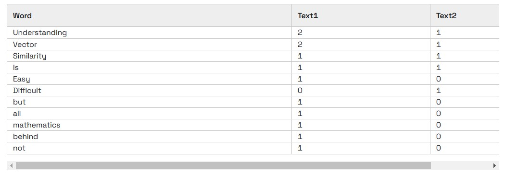
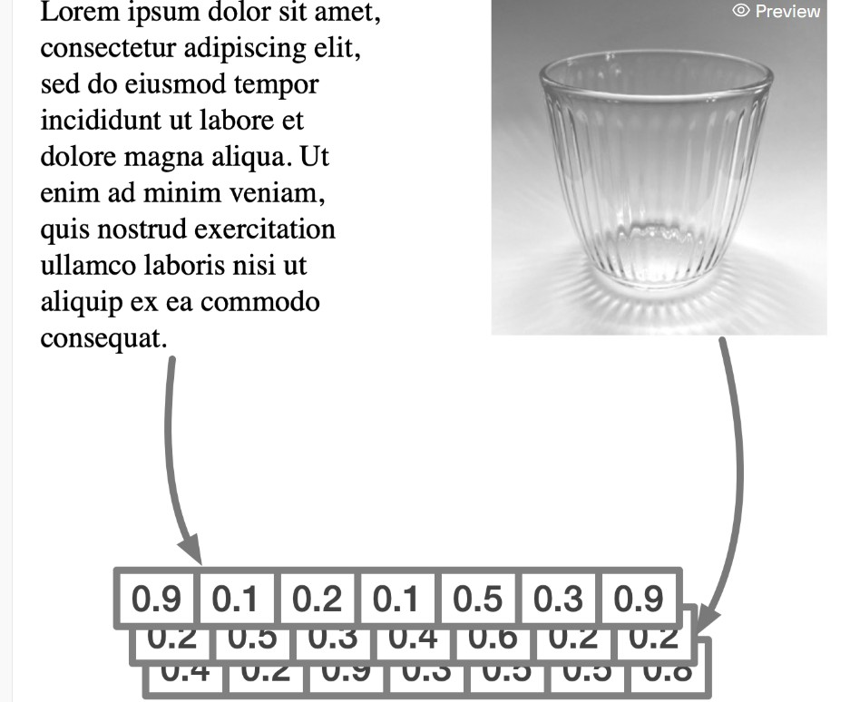

### [Introduction to semantic search](https://university.redis.io/course/9xcwbkijvf4a4k)


#### I. From full-text to semantic search

Redis Stack, with its flexible secondary indexing capabilities, supports filters for textual or numerical fields and enables different strategies to retrieve the desired data. In fact, with Redis Stack, it is possible to retrieve documents using full-text, numeric, and tag filters and include additional geospatial filtering, leveraging the supported geometries and spatial relations.

In particular, Redis Stack full-text search can be extended to include synonyms, consider the base form of a word, or even consider the pronunciation using phonetic matching. These powerful tools help you dive into your data and extract the relevant content. However, searching for the best matches using the traditional filters does not always reflect the user's intention because full-text search is based on literal matches of words and their variations but does not dig into the meaning of the query for which the user would like to get an answer. To make an example, if we are interested in animals chasing other animals, we may search by the term chase and get:

- "The cat chased the dog"

- "The dog chased the cat"

However, if we would like to filter the results further and get the specific sentence The dog chased the cat or similar sentences preserving the same meaning (dogs chasing cats), full-text cannot help further, as it cannot dig into the meaning of the text stored in the database.

**What is Semantic Search?**

Semantic search extends traditional database search methods to interpret the user's query and extract the documents that match the semantic meaning of the query. With the semantic search features, it is possible to query the database in natural language: it understands the semantics behind the query and returns meaningful results. Such technology has been on the market for years. However, semantic search is gaining more traction thanks to the advances in Artificial Intelligence and Machine Learning and the availability of on-demand scalable and affordable computational resources. In short, semantic search allows querying the database with a question such as "return all the documents with dogs chasing cats." In the next section, we will understand how data modeling is crucial to performing semantic search and what are the popular methods.


#### II. Modeling unstructured data

Semantic search helps to measure the semantic similarity of unstructured data such as texts, images, or media files. This is achieved by generating a vector that represents the features of the data under analysis because the vector is a convenient data structure to compress information and is easily manageable by a computer. We will introduce the techniques to transform unstructured data into a vector through practical examples and guide you to developing a simple application.

Vectors have a massive role in modern Data Science and Machine Learning. With them, we can represent thousands of features for unstructured data, such as long texts, images, audio files, and more, using lists of floating point numbers. You can describe an entity as a vector in different terms; an intuitive way to visualize this representation might be RGB color codes.


When working with texts, there are several methods to represent them as arrays of numbers. An example may be expressing texts with the frequency of the words they contain. Consider these two sentences:

- "Understanding vector similarity is easy, but understanding all the mathematics behind a vector is not!"

- "Understanding vector similarity is difficult."

For a vectorized representation of these texts, we can list and count the repetition of words.



However, representing sentences and longer texts using this model based on the repetition of words does not help extract the meaning of sentences, as in the example we have considered.

- "The cat chased the dog"

- "The dog chased the cat"

Modeling the two sentences based on a word frequency model does not retain the meaning of the sentence... who chases whom? To resolve the problem and be able to represent the semantics of unstructured data, as in this example, machine learning models come to the rescue. Machine learning models are, in a very simplified way, functions that accept unstructured data as input and produce numerical representations. Deep learning techniques develop such models and can capture the input object's unique data features. The next unit introduces the embedding models and shows how to obtain vectors in a few lines of code.


#### III. Working with vector embeddings

Vectors represent unstructured data and are essentially lists of decimal numbers. When vectors are used in semantic search, we refer to **vector embeddings**. The term "embedding" helps reflect the transformation of data to a lower-dimensional space while preserving the features of the original data, so the vector embeds the structures and relationships of the original data (which may be the semantic meaning of a paragraph or the attributes like colors, angles, lines, and shapes in a picture, and so on).



> Embedding models translate the human-perceived semantic similarity to the vector space

When the original unstructured data is transformed into vector embeddings (or simply "embeddings"), these have variable dimensions depending on the chosen method/algorithm to perform the transformation. Different approaches capture data semantics differently, so the output size follows. However, when working with unstructured data, the size of the embeddings must be determined at design time; this is required to be able to perform comparisons. Comparisons between vectors happen in the same vector space, where the vectors have the same size.

**How to create vector embeddings?**

Embeddings can be generated using several heterogeneous techniques that facilitate the translation of semantic similarity into similarity between vectors. We have considered the frequency model for texts, but any method aiming at representing data in the form of a vector may be a valid approach. Nonetheless, other aspects should be considered to validate the approach's viability besides the quality of the embeddings. Procedures requiring manual intervention usually scale poorly and may require human expertise and domain knowledge to produce quality output. For this and other reasons, deep learning techniques and neural networks have become first-class citizens in addressing the problem and resolve efficiently the data modeling problem.

The availability of pre-trained machine learning models has helped spread and standardize the approach. In practice, many machine learning projects use pre-trained embedding models as a starting point, and benchmarking and fine-tuning them for the specific task helps introduce semantic search into a service.

When a machine learning model generates vectors, they embed the distinctive features of data into floating point numbers of fixed size in a compact and dense representation and translate the human-perceived semantic similarity to the vector space. The semantic similarity of two objects (two texts expressing the same concepts and overall meaning or two similar pictures) translates to the "numerical similarity" of two vectors, which is calculated as the distance between vectors, a simple mathematical operation.


#### IV. Lab Guide | Using embedding models

The generation of vector embeddings can be automated using commercial or open pre-trained transformer models.

**Working with text**

The following example creates a 384-dimension vector of floats. The code sample uses the open all-MiniLM-L6-v2 model. To run this example, first create and activate a Python virtual environment on your machine as follows.

```
python -m venv redisvenv source ./redisvenv/bin/activate
```

Then, you can install the Python library sentence_transformers as follows:

```
pip install sentence_transformers
```

And then download the code provided in the file [generate_text_embeddings.py](https://github.com/redislabs-training/ru402/blob/main/courseware/activities/section_1/generate_text_embeddings.py). The first time the sample is executed, the requested embedding model all-MiniLM-L6-v2 is downloaded and stored. Wait patiently, this can take a few seconds.

**Working with images**

You can think of various applications that, based on the similarity of images, implement use cases like product recommendation based on the aspect, object recognition, face recognition, and more. You can convert images to vector embeddings using commercial or free pre-trained models.

As an example, you may use [imgbeddings](https://pypi.org/project/imgbeddings/). This library produces 768-dimension vectors of floats that can be used for image similarity, among other uses. Install the library in the Python virtual environment:

```
pip install imgbeddings
```

Then download and run the code provided in the file [generate_image_embeddings.py](https://github.com/redislabs-training/ru402/blob/main/courseware/activities/section_1/generate_image_embeddings.py) to print on the screen the first five elements of the vector corresponding to an image downloaded from the Internet.


#### V. Summary

Different types of unstructured data require specific embedding models to perform the conversion to vector, so you will find models for images, audio files, and text, each specialized for the features that must be extracted. Once the model has been evaluated and employed in a project, it is possible to map a dataset to the vector space and work with it. Once each element in your dataset has a vector associated, you can evaluate the similarity between pairs of vectors and determine the semantic similarity of the related objects they represent using a standard method: vector search, which we'll introduce in the next section.


#### VI. Quiz | Introduction to Semantic

1 What is a limitation of traditional full-text search when searching for relevant documents?


- It cannot handle numerical filters

- It does not differentiate documents with similar wording but different meaning

- It cannot process geospatial data

- It does not support tag filters


### EOF (2025/02/15)
