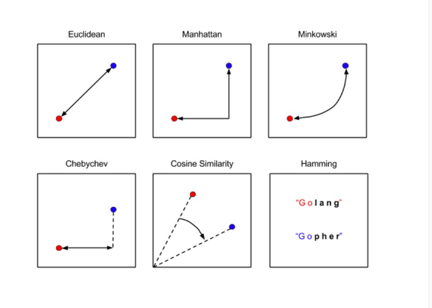
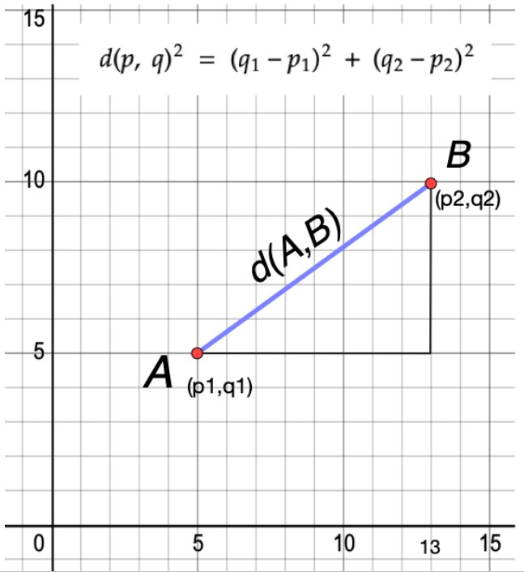
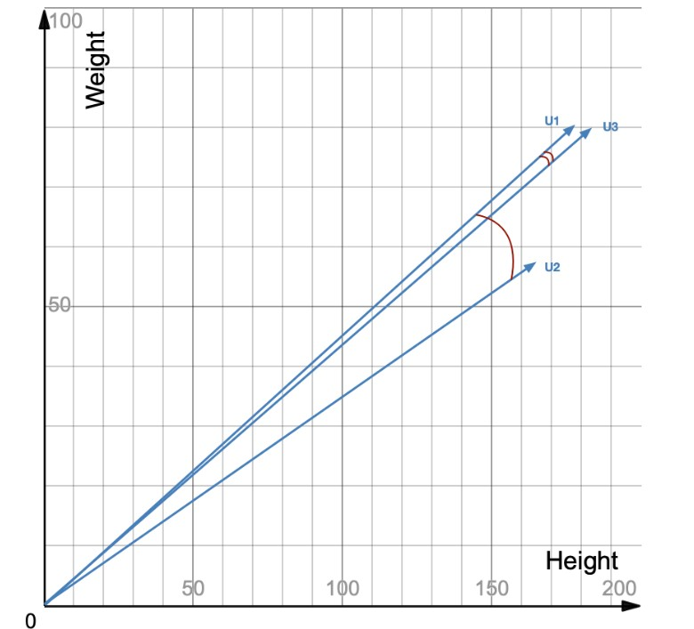
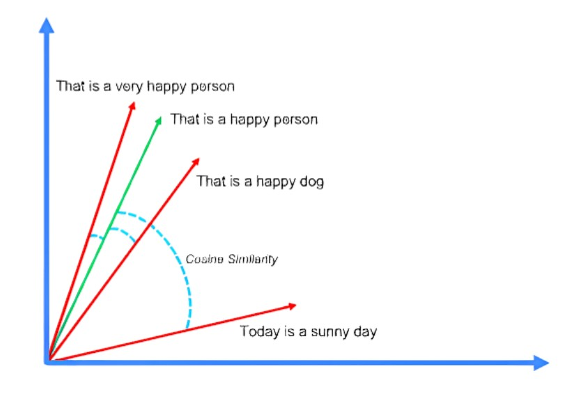

### [Redis as a vector database](https://university.redis.io/course/7e2qbbeg963twz/submodule/pdeyytvexwjcpy/)


#### I. Accelerating semantic search

Pre-trained machine learning models simplify the job of data scientists and avoid lengthy and complex operations to turn objects into the corresponding vector embedding. However, managing massive datasets for development and production environments becomes challenging, especially when real-time throughput, scalability, and high availability are not negotiable requirements.

The availability of machine learning models has boosted the rise of modern use cases and, consequently, the development and adoption of vector databases. Vector databases can store vectors and index and search the vector space efficiently.

Vector databases resolve the problem of managing vectors and their operations, so they must meet specific throughput requirements, ensuring they can handle increasing volumes of data and queries. Hence, it is crucial to ensure the scalability of the data layer and guarantee high availability, with high uptime and uninterrupted access to the stored vector data in case of disaster or maintenance operations.


In the following units, we will learn how Redis Stack is designed to perform vector search across millions of vectors with real-time performance. In addition, we will discover how Redis Enterprise and Redis Cloud are designed for high availability and scalability and allow the design of production-ready modern applications.

#### II. Modeling vectors in Redis

All the Redis database flavors can store, index, and search vectors. This means that you can work with vectors using the [Redis Stack](https://redis.io/docs/about/about-stack/) distribution in your development environment and also for functional testing. Redis Enterprise and Redis Enterprise Cloud are built upon the Redis Stack capabilities, but they also offer a robust set of features to work efficiently with vectors at scale.


First, it is important to highlight that before the native support for vectors was introduced in Redis Stack Server 6.2.2-v1 in 2022, vectors would be stored in Redis as a string, so serializing the vector and storing it in the desired data structure. An example using the String:

```
SET vec "0.00555776,0.06124274,-0.05503812,-0.08395513,-0.09052192,-0.01091553,-0.06539601,0.01099653,-0.07732834,0.0536432"
```

Redis can store any arbitrary object once serialization and deserialization routines are available. A vector is just another object that Redis can store when serialized to the String type. However, Redis has no awareness of the intrinsic nature of the stored object and does not offer any feature to search through the space of vectors.

Since Redis Stack Server 6.2.2-v1, vectors can be stored as Hash or JSON documents, providing flexibility in how data is structured and accessed. Multiple indexing methods are supported, including FLAT and HNSW, enabling users to choose the most suitable approach for their specific use cases. Users can privilege precision over speed with the FLAT method or ensure high throughput with a little compromise on accuracy using HNSW. Additionally, Redis offers support for various distance metrics such as L2, IP, and COSINE, further enhancing the precision and efficiency of vector searches for specific types of embeddings. With these features, Redis becomes a flexible solution for businesses seeking to harness the power of vector data in diverse applications, from recommendation engines to similarity search tasks.

#### III. Storing vectors: the HASH and JSON data types

Vector search is based on determining how similar or dissimilar two vectors are. To do this consistently, some quantifiable and objective score must be obtained. These scores are called **Distance Metrics**. There's more than one method to determine the similarity of two vectors; thus, we can consider multiple distance metrics. These are not just different means to the same result: different distances measure different things, such as the length of the vector representing the difference, or the angle between the two vectors.



In this unit, we'll introduce three of the most popular distances:

- Euclidian distance

- Internal product

- Cosine similarity

**Euclidian distance**

The Euclidean distance is one of the most used distance metrics, and it calculates the distance between two data points on a plane.



If we expand this logic to the numerical values in a vector, we can use the same formula to calculate the distance between vectors in the two-dimensional space. Imagine that **A** and **B** are two observations from our data set, with x1, and y1 being the two features of observation **A**, and x2, and y2 being the two features of observation **B**. Calculating the Euclidean Distance would tell us how similar A and B are, and we could use this similarity to make predictions or group our observations. The example is easily expandable to N-dimensions.

The Euclidean distance is the default distance metric used by many algorithms and generally gives good results. Conceptually, it should be used whenever we are comparing observations in which features are continuous, numeric variables like height, weight, or salaries, for example, although it should be noted that it works best with low-dimensional data and where the magnitude of the vectors is essential to be measured.

**Internal product**

To determine similarity, the **internal product looks at both the angle and magnitude of vectors**. It's found by projecting one vector on the other and multiplying the result with the magnitude of the second vector. Let's look at this in two-dimensional space:


How do we generalize this for the n-dimensional space? First, to apply the inner product to two vectors, they must be the same size (in our example, we'll work with two four-dimensional vectors). Then, we multiply element-wise the ordered vectors, element by element, and sum the products in the end. The result of a dot product of two vectors is a scalar.

a = (3, 6, 1, 8) 

b = (3, 2, 2, 1) 

a⋅b = 3x3 + 6x2 + 1x2 +8x1 = 9 + 12 + 2 + 8 = 31

The generalized formula for this product is:


**Cosine similarity**

Cosine similarity is the first metric you would reach since it gives consistently good results, especially for high dimensional vector spaces. It is a good choice for use cases like document similarity, image comparison, pose comparison (in computer vision), and much more. Unlike the internal product, cosine similarity looks **only at the angle** between two vectors to determine similarity. Specifically, it looks at the cosine of the angle.



In the image of three vectors in the two-dimensional space above, we can see that the vectors U1 and U3 have a slight angle between them, which means they're more similar. U1 and U2, however, have a more significant angle between their vectors, which means the vectors are less similar. Two vectors with the same orientation have a cosine similarity of 1, whereas two vectors opposed to each other have a similarity of -1. Their magnitude is not of importance as this is a measure of orientation. If we move to an n-dimensional space with vectors a and b, using the cosine measure as a similarity function, we have:


where a⋅b is the dot product of the two vectors and ||a|| is the Euclidean norm of vector a=(a1,a2,…,an): conceptually, the length of the vector. Similarly, ||b|| is the Euclidean norm of vector y. The measure computes the cosine of the angle between vectors a and b. A cosine value of 0 means that the two vectors are at 90 degrees to each other (orthogonal) and have no match. The closer the cosine value to 1, the smaller the angle and the greater the match between vectors.

If you normalize the vectors, cosine similarity and internal product give the same result, which makes the intuition behind using it as a metric very similar to the internal product. Still, cosine similarity should be chosen when magnitude doesn't play a high role in similarity.

> *Normalized vectors are vectors with a magnitude of 1, so normalizing a vector means setting its magnitude to one but keeping its direction. This is done by dividing each of the vector's components by its magnitude*.


#### IV. Working with hashes

#### V. Working with JSON documents

#### VI. Lab Guide | Searching vectors

#### VII. Data types, distances and indexing methods

#### VIII. Lab Guide | Vector search with range queries

#### IX. Lab Guide | Vector search with hybrid queries


#### X. Quiz | Redis as a Vector Database 


In this activity you will run a simple example to model the sentences considered before:

- "That is a very happy person"

- "That is a happy dog"

- "Today is a sunny day"

Then, you will test the similarity of the sentence "That is a happy person" to the three sentences. You can create a Python environment and install the required libraries to run the example as follows:

python -m venv redisvenv source ./redisvenv/bin/activate pip install numpy pip install sentence_transformers

Once your virtual environment is configured, you can move on to the rest of the tasks.

1. Download the code provided in the file [cosine_distance.py](https://github.com/redislabs-training/ru402/blob/main/courseware/activities/section_2/cosine_distance.py).

2. Study the code example. In particular, focus on the vector embedding generation and the algorithm that computes cosine similarity in the function cosine_similarity(a, b)

3. Execute the example. The first time the sample is executed, the requested embedding model all-MiniLM-L6-v2 is downloaded and stored. Wait patiently, this can take a few seconds.

Running this example returns the following output:

Query: That is a happy person That is a very happy person  -> similarity score =  0.9429151 That is a happy dog  -> similarity score =  0.6945774 Today is a sunny day  -> similarity score =  0.256876

We could have expected that the sentences "That is a happy person" and "That is a very happy person" represent the pair having the highest similarity score. In the example, we are comparing the angles between pairs of vectors in a 384-dimensional vector space using the cosine distance.



The closest the angle between the two vectors to zero, the closest is the cosine to one, which indicates a higher similarity between the two sentences.

Congratulations! You are now able to calculate the similarity of vectors to retrieve semantically relevant results!


#### V. Quiz | Introduction to Vector Search

1. What operation must be executed in preparation for performing vector search?

- Vectorize the documents in a two-dimensional vector space (　)

- Define a distance that will be used to compute the similarity of the vectors ( &#10003;
 )

- Sort the vectors based on their length (　)

- Create a full-text search index and perform data indexation (　)

2. What does cosine similarity primarily focus on in vector search?

- The magnitude of vectors (　)

- The Euclidean distance between vectors (　)

- The angle between vectors ( &#10003;
 )

- The internal product of vectors (　)


### EOF (2025/02/21)
